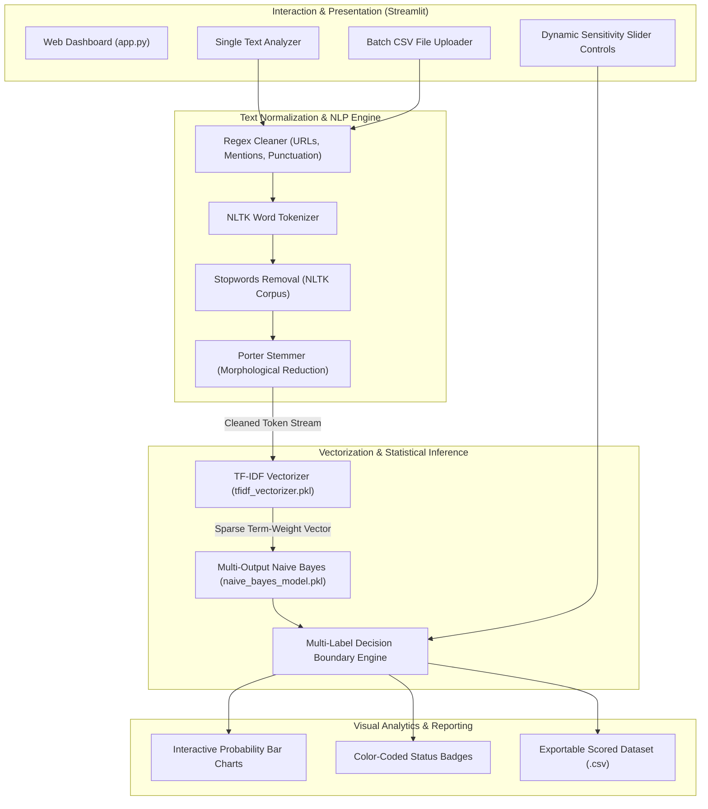

<br/><br/>

<!-- Animated Title -->
<p align="center">
  <a href="#">
    
  </a>
</p>

<p align="center">
  <b>Production-Grade Multi-Label Content Moderation & Toxic Comment Intelligence Engine</b><br/>
  <i>Multi-Label Classification · Toxic / Obscene / Threat / Insult / Hate Speech Detection · Real-Time Streamlit Interface · Batch CSV Scoring</i>
</p>

<br/>

<!-- Badges Row 1: Core Technologies -->
<p align="center">
  
  
  
  
  
</p>

<!-- Badges Row 2: UI & Deployment -->
<p align="center">
  
  
  
  
  
</p>

<!-- Badges Row 3: Standards & License -->
<p align="center">
  
  
</p>

<br/>

<!-- Quick Navigation Bar -->
<p align="center">
  <a href="#-overview"></a>
  &nbsp;
  <a href="#-problem-statement--safety-solution"></a>
  &nbsp;
  <a href="#-multi-label-categories"></a>
  &nbsp;
  <a href="#%EF%B8%8F-system-architecture"></a>
  &nbsp;
  <a href="#-machine-learning-pipeline"></a>
  &nbsp;
  <a href="#-technical-stack"></a>
  &nbsp;
  <a href="#-quickstart--execution"></a>
</p>

---

## 📌 Overview

**Moderation System** is an automated, high-throughput Natural Language Processing (NLP) intelligence platform designed to detect and classify toxic online content, hate speech, and harassment across digital platforms. Engineered to solve the challenge of automated community moderation, the system evaluates incoming text simultaneously across **six distinct toxicity dimensions**.

Rather than relying on brittle keyword blocklists that are easily evaded through obfuscation, this platform combines **NLTK morphological text normalization** (Porter Stemming, URL/mention cleaning, stopword filtering) with a high-dimensional **TF-IDF sparse vectorizer** and a calibrated **Multi-Output Multinomial Naive Bayes model**.

```
                   ┌────────────────────────────────────────────────────────┐
                   │             Moderation System Engine                   │
                   │                                                        │
[ User Comment / ]─┼──> [ Text Normalizer ] ──> Stemmed Tokens ─────────────┼──> [ Moderation Report ]
[ Batch CSV File ] │             │                                          │    - Multi-Label Verdict
                   │             ▼                                          │    - Probability Gauges (0-100%)
                   │    [ TF-IDF Vectorizer ] ──> Sparse Feature Vector     │    - Dynamic Threshold Filter
                   │             │                (n-gram vocabulary)       │    - Flagged Obscenity Badges
                   │             ▼                                          │    - CSV Exportable Audit Log
                   │    [ Naive Bayes Model ] ──> 6-Class Probability Array │
                   └────────────────────────────────────────────────────────┘
```

---

## 🎯 Problem Statement & Safety Solution

<table>
<tr>
<td width="50%" valign="top">

### ❌ The Digital Moderation Crisis

Online communities, gaming platforms, and social forums face severe trust & safety challenges:

- 🌊 **Massive Comment Volume**: Millions of comments per day overwhelm human moderation teams.
- 🎭 **Nuanced Harassment**: Toxicity takes diverse forms (threats, identity attacks, insults) requiring multi-label rather than binary flags.
- 🕳️ **Evasion of Naive Keyword Filters**: Bad actors bypass static word filters through subtle variations, leetspeak, and slang.
- ⏱️ **Latency Constraints**: Live chat systems require sub-10ms classification latencies to filter toxic comments before publication.

</td>
<td width="50%" valign="top">

### ✅ The Moderation System Solution

| Challenge | Moderation System Architectural Solution |
| :--- | :--- |
| **Granular Safety Dimensions** | Independent simultaneous evaluation across **6 critical labels** (`toxic`, `severe_toxic`, `obscene`, `threat`, `insult`, `identity_hate`). |
| **Sub-Millisecond Speed** | Ultra-efficient **TF-IDF + Multinomial Naive Bayes** inference delivering real-time responses ($<5\text{ms}$). |
| **Robust Normalization** | **Regex URL & Mention Stripping + Porter Stemmer** preventing trivial syntactic evasion. |
| **Calibrated Thresholds** | Interactive UI slider enabling custom sensitivity tuning per toxicity tier. |
| **Batch Enterprise Auditing** | One-click CSV batch analysis supporting up to tens of thousands of rows with exportable scoring. |

</td>
</tr>
</table>

---

## 🔥 Multi-Label Categories

<table>
<tr>
<td width="33%" align="center" valign="top">

### ⚠️ Toxic & Severe
<br/>
<b>General Maliciousness</b>
<p align="left">
• <code>toxic</code>: Hostile, rude, or aggressive text likely to drive users away.<br/>
• <code>severe_toxic</code>: Extremely aggressive, threatening, or excessively hateful language.
</p>

</td>
<td width="33%" align="center" valign="top">

### 🔞 Obscene & Threat
<br/>
<b>Vulgarity & Endangerment</b>
<p align="left">
• <code>obscene</code>: Vulgar, profane, or sexually offensive text.<br/>
• <code>threat</code>: Explicit or implicit declarations of intent to cause physical injury or harm.
</p>

</td>
<td width="33%" align="center" valign="top">

### 🛑 Insult & Identity Hate
<br/>
<b>Targeted Harassment</b>
<p align="left">
• <code>insult</code>: Disrespectful, humiliating, or demeaning statements targeting individuals.<br/>
• <code>identity_hate</code>: Hate speech targeting race, religion, gender, ethnicity, or sexual orientation.
</p>

</td>
</tr>
</table>

---

## 🏗️ System Architecture

The architecture provides both an interactive visual diagnostic laboratory via **Streamlit** and a reusable serialized inference bundle for backend microservice integration.



---

## 🔬 Machine Learning Pipeline

### 1. Linguistic Preprocessing Pipeline
Every input string undergoes standardized morphological normalization:
1. **URL & Handle Stripping**: Eliminates `https?://\S+`, `www.\S+`, and `@username` entities.
2. **Special Character Pruning**: Strips punctuation and digits while preserving word tokens.
3. **Case Folding**: Canonicalizes text to lowercase.
4. **NLTK Stopword Filtering**: Removes high-frequency syntactic noise words without semantic toxicity value.
5. **Porter Stemming**: Truncates words to root stems (e.g., *"threatening"* $\to$ *"threaten"*).

### 2. Feature Extraction & Classification
- **TF-IDF Matrix**: Maps vocabulary n-grams into a high-dimensional sparse coordinate space weighted by Term Frequency-Inverse Document Frequency.
- **Multinomial Naive Bayes Formulation**:
  $$P(y_k \mid \mathbf{x}) \propto P(y_k) \prod_{i=1}^{n} P(w_i \mid y_k)^{x_i}$$
  Where $y_k \in \{\text{toxic}, \text{severe\_toxic}, \text{obscene}, \text{threat}, \text{insult}, \text{identity\_hate}\}$.
- **Decision Rule**: A label $k$ is flagged if and only if $P(y_k \mid \mathbf{x}) \ge \theta_k$, where $\theta_k$ is adjustable via the UI sensitivity sliders (default $\theta = 0.50$).

---

## ⚙️ Technical Stack

| Component | Technology | Purpose & Implementation |
| :--- | :--- | :--- |
| **Interactive UI** | **Streamlit** | Low-latency reactive web application with dual Single-Text and Batch-File tabs |
| **Machine Learning** | **Scikit-Learn** | Pipeline implementation of TF-IDF Vectorizer and Multinomial Naive Bayes |
| **NLP Morphological Core** | **NLTK** | Word tokenization, Porter Stemmer, and English stopword dictionaries |
| **Data Handling** | **Pandas & NumPy** | High-performance vector arithmetic and CSV batch parsing |
| **Serialization** | **Joblib** | Serialization and rapid deserialization of trained model artifacts |
| **Container Environment** | **VS Code DevContainer** | Pre-configured reproducibility environment |

---

## 📁 Repository Structure

```
Moderation_System/
├── 📄 app.py                       # Streamlit web application & inference routines
├── 📄 moderation-system.ipynb      # Training notebook (EDA, training, validation, export)
├── 📄 naive_bayes_model.pkl        # Serialized trained Multi-Output Naive Bayes model
├── 📄 tfidf_vectorizer.pkl         # Serialized high-dimensional TF-IDF vectorizer
├── 📄 sample_submission.csv        # Benchmark test predictions format
├── 📄 requirements.txt             # Python dependencies
├── 📁 .devcontainer/               # VS Code DevContainer development configuration
└── 📄 README.md                    # Project documentation
```

---

## 🚀 Quickstart & Execution

### Prerequisites
- **Python**: 3.10 or higher
- **Virtual Environment**: Recommended for dependency isolation

---

### 1. Installation

```bash
# 1. Clone repository
git clone https://github.com/IbrahimAbdelsattar/Moderation_System.git
cd Moderation_System

# 2. Create virtual environment
python -m venv venv
source venv/bin/activate        # On Windows: .\venv\Scripts\activate

# 3. Install dependencies
pip install -r requirements.txt
pip install streamlit scikit-learn nltk pandas joblib
```

---

### 2. Running the Moderation Studio

```bash
streamlit run app.py
```

*The interactive studio will open automatically at `http://localhost:8501`.*

---

## 👥 Author & Connect

**Ibrahim Abdelsattar**  
*AI Engineer & Machine Learning Specialist*

- 🌐 **GitHub**: [@IbrahimAbdelsattar](https://github.com/IbrahimAbdelsattar)
- 💼 **LinkedIn**: [Ibrahim Abdelsattar](https://www.linkedin.com/in/ibrahim-abdelsattar/)
- 📧 **Email**: [ibrahimabdelsattar042@gmail.com](mailto:ibrahimabdelsattar042@gmail.com)

---

<p align="center">
  <sub>Engineered for digital safety, trust, and automated content moderation. © 2026 Moderation System.</sub>
</p>
