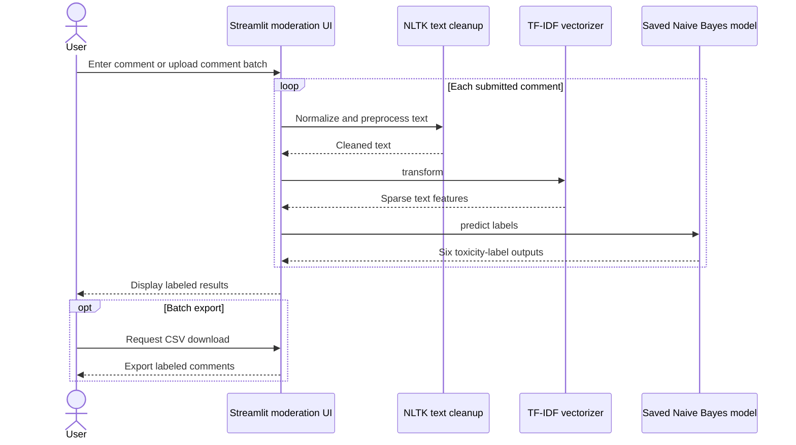

# Content Moderation System

A multilabel text classification project for flagging six categories of potentially harmful comments, with single-comment and CSV batch inference.

**Technology:** Python · TF-IDF · Naive Bayes · scikit-learn · NLTK · Streamlit

## Features

- Predict `toxic`, `severe_toxic`, `obscene`, `threat`, `insult`, and `identity_hate` labels.
- Clean text using the NLTK-based preprocessing implemented in `app.py`.
- Load a fitted TF-IDF vectorizer and Naive Bayes model from local files or configured URLs.
- Upload a CSV containing `id` and `comment_text`, inspect predictions, and export results.

## Repository guide

| Path | Purpose |
|---|---|
| [app.py](app.py) | Streamlit moderation workflow. |
| [moderation-system.ipynb](moderation-system.ipynb) | Training experiments and evaluation. |
| [naive_bayes_model.pkl](naive_bayes_model.pkl) | Saved multilabel classifier. |
| [tfidf_vectorizer.pkl](tfidf_vectorizer.pkl) | Fitted text vectorizer. |
| [sample_submission.csv](sample_submission.csv) | Example output schema. |
| [requirements.txt](requirements.txt) | Inference dependencies. |

## Requirements and current limitations

Run from the repository root with both model artifacts present. NLTK resources may be downloaded on first use. Supply the original train/test datasets separately to reproduce the notebook, and install its additional training dependencies.

Preserve preprocessing and label order across training and deployment. Automated flags should be reviewed in context; the README does not claim a measured production accuracy.

## UML diagrams

### Main workflow

The moderation interface handles one comment or a batch using shared cleanup, TF-IDF features, and a multi-label classifier.


```mermaid
sequenceDiagram
    actor User
    participant App as Streamlit moderation UI
    participant Clean as NLTK text cleanup
    participant Vector as TF-IDF vectorizer
    participant Model as Saved Naive Bayes model
    User->>App: Enter comment or upload comment batch
    loop Each submitted comment
        App->>Clean: Normalize and preprocess text
        Clean-->>App: Cleaned text
        App->>Vector: transform
        Vector-->>App: Sparse text features
        App->>Model: predict labels
        Model-->>App: Six toxicity-label outputs
    end
    App-->>User: Display labeled results
    opt Batch export
        User->>App: Request CSV download
        App-->>User: Export labeled comments
    end
```

## Getting started

```bash
git clone https://github.com/IbrahimAbdelsattar/Moderation_System.git
cd Moderation_System
```

Use a Python virtual environment:

```bash
python -m venv .venv
```

Activate it with `source .venv/bin/activate` on macOS/Linux or `.venv\Scripts\Activate.ps1` in PowerShell.

```bash
python -m pip install -r requirements.txt
python -m streamlit run app.py
```
